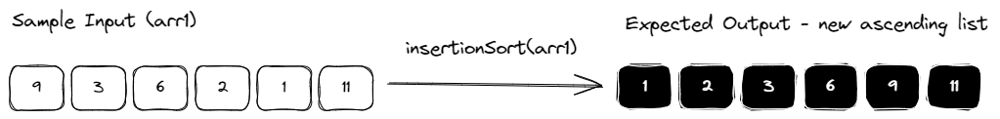
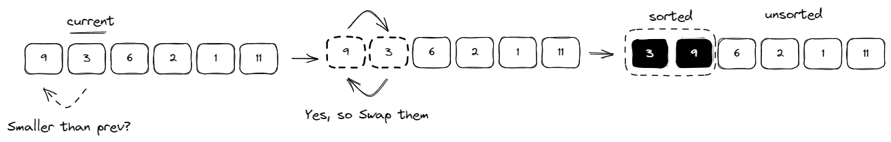
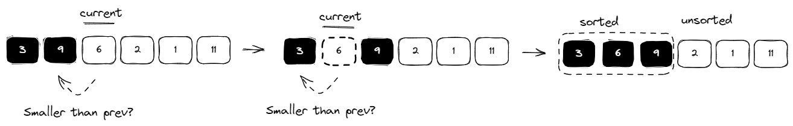

# Insertion Sort

Implement a function that performs an insertion sort. The function should take in an array of integers and return an array with the integers sorted in ascending order. The input array is modified.



Examples

```
insertionSort([9, 3, 6, 2, 1, 11]); // [1, 2, 3, 6, 9, 11]
insertionSort([12, 16, 14, 1, 2, 3]); // [1, 2, 3, 12, 14, 16]
```

Recap
Insertion sort is a simple sorting algorithm which compares elements one at a time with preceding element(s), "inserting" them into the correct position, and progressively building up a sorted array.

The algorithm starts by examining the 2nd element of the input array (the "current" element), and compares it with its preceding element (i.e. the 1st element). If the current element is smaller, we swap their places (by copy). The result is that the first 2 elements are sorted correctly in ascending order.



The algorithm then moves onto the next element in the input list and compares it with preceding elements (already sorted in ascending order) to insert it into the right position. Since preceding elements are already sorted, the algorithm only needs to compare the current element with every preceding element until the current element is not smaller than that element. It's then inserted into the right position in the list and the algorithm moves onto the next element in the input list.

For e.g., continuing from the example above, the algorithm will move onto the 3rd element as the "current" element and compare it with the preceding sorted list. By iterating backwards through the preceding list, the current element is compared progressively with the 2nd element, followed by the 1st element, until it is no longer smaller than that element. It will then insert itself into that position. If its smaller than both the 2nd and 1st element, it is simply inserted at the start of the list as the smallest element.



## Solution

Insertion sort is a stable, in-place, comparison-based algorithm that works well for small to medium-sized arrays as well as arrays that are partially sorted.

It only requires a constant amount of work to sort an array that is already partially sorted.

Clarification Questions
If unspecified:

- Should the data be sorted in an ascending or descending order?
- Should the data be sorted in-place or is it acceptable to use additional data structures?
- What kinds of inputs do we need to handle?
- Will it just be an array of integers or should we handle other data types?
- Are there a large number of duplicate elements?
- How should negative numbers be handled?

**Solution**
Note: This question tackles in-place sorting for an output in ascending order. Refer to the 'Notes' section below on how to handle other cases.

```typescript
export default function insertionSort(arr: Array<number>): Array<number> {
  // Iterate through the array, starting with the 2nd element.
  for (let i = 1; i < arr.length; i++) {
    // Store the current value in a variable so it
    // can be shifted to the correct position after the comparisons.
    let currentValue = arr[i];

    // Initialize a pointer for the index of the previous element
    // so we can use it to iterate progressively backwards
    // through preceding elements.
    let j = i - 1;

    // Keep iterating backwards through preceding elements
    // as long as the previous element is greater than the current value.
    while (j >= 0 && arr[j] > currentValue) {
      // "Move" the previous element one position to the right.
      // if it's bigger than currentValue.
      arr[j + 1] = arr[j];

      // Decrement the pointer so as to keep comparing with the
      // previous element.
      j--;
    }

    // Set the currentValue into its final position.
    arr[j + 1] = currentValue;
  }

  // Return the sorted array.
  return arr;
}
```

**Edge Cases**

- Non-integer element input: If the input array comprises of elements of different data types, you may need to return an error, settle for sorting on a best-effort basis, for e.g., only sorting a subset of the input data, or even define custom comparison functions for non-integers.
- Single element / Empty input: Either return the original data structure, raise an error, or clarify required handling.
- Large input: You may want to consider using additional optimizations like binary search to speed up insertions.
- Already sorted input: You may want to detect sorting and return the input unchanged.
- Invalid input: If the input is not a array, consider throwing an error.

**Notes**

- If asked to sort in descending order: Just change the comparison to < instead of >, as per below:
  `while (j >= 0 && arr[j] < currentValue)`
- If asked to use additional data structures or to write a pure function rather than sorting the data in-place, use the spread operator or Array.prototype.slice() to clone the input array and do the sorting on the cloned array instead.

**Time Complexity**
In the case of insertion sort, the best case time complexity is O(n), the worst case time complexity is O(n2), and the average case time complexity is also O(n2).

Due to the nested loop structure required in insertion sort where we have an outer loop that iterates over the array and inner loop which iterates over the already sorted array to find the correct position to insert the current element, the time complexity will generally be O(n2) if both loops iterate fully. The discrepancy between different cases is affected by how well sorted the original input is, which affects if we need to run the inner loop at all for specific elements.

- Worst case time complexity: When the input is arranged in the complete opposite order the output has to be (e.g. ascending when we need descending). We will need to iterate fully through outer and inner loops for every element, with a time complexity of O(n2).
- Best case time complexity: When the input is already sorted or nearly sorted. This means that the inner loop will not need to iterate very much. In the very best case, the input array is already completely sorted and we only run the outer loop for O(n) complexity.
  Average case time complexity: Considering the case where the input array is randomly arranged, the inner loop of the algorithm must still iterate over the sorted portion of the array in order to find the correct position to insert the current element.

**Space Complexity**
The space complexity for insertion sort is O(1), as it does in-place sorting and does not require additional storage proportional to input size.
