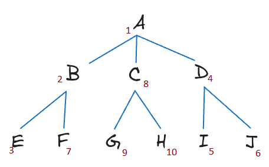

# Depth-first Search

DFS is a graph traversal algorithm that starts at a root node and explores as far as possible along each branch before backtracking. This means it delves deeply into a branch until it reaches a dead end (no unvisited neighbors) and then returns to explore a neighbor of the previous node.



Write a function that implements the depth-first search algorithm on a directed graph (in adjacency list format), given a starting node.

Examples

```typescript
const graph1 = {
  A: ["B", "C", "D"],
  B: ["E", "F"],
  C: ["G", "H"],
  D: ["I", "J"],
  E: ["D"],
  F: [],
  G: [],
  H: [],
  I: [],
  J: [],
};
depthFirstSearch(graph1, "A"); // ['A', 'B', 'E', 'D', 'I', 'J', 'F', 'C', 'G', 'H']
depthFirstSearch(graph1, "B"); // ['B', 'E', 'D', 'I', 'J', 'F']

const graph2 = {
  A: ["B", "C"],
  B: ["D", "E"],
  C: ["F", "G"],
  D: [],
  E: [],
  F: [],
  G: [],
};
depthFirstSearch(graph2, "A"); // ['A', 'B', 'D', 'E', 'C', 'F', 'G']
depthFirstSearch(graph2, "E"); // ['E']
```

### Recap (Hint)

Depth-first search (DFS) is an algorithm used for traversing a graph or a tree. The output from DFS is an array of the graph's nodes in the order they were traversed. This output is useful for a variety of different use cases and purposes, which makes DFS a useful algorithm to know. Some use cases:

- Find a specific node or group of nodes. This is common in front end to find specific DOM node(s) within the DOM tree.
- Checking if a graph is connected.
- Finding a path between two nodes in a graph.
- Generating a topological sort of a directed acyclic graph (DAG).
- Identifying cycles in a graph.
- As a building block for other algorithms.

  Here is an overview of how DFS works to traverse a graph, using the standard implementation that takes in an adjacency list (we use an array instead) and the root node:

- Initialize an array or a stack to store nodes to be visited. Push root node.
- Initialize a set to track visited nodes.
- Enter a loop that continues until the stack is empty. In each iteration of the loop:
  - Pop the top node from the array / stack.
  - Retrieve the neighbors of the node from the input graph.
  - For each neighbor, check if it has been visited. If it has not been visited, add it to the set of nodes to be visited.
- Return the set of visited nodes.

## Solution
