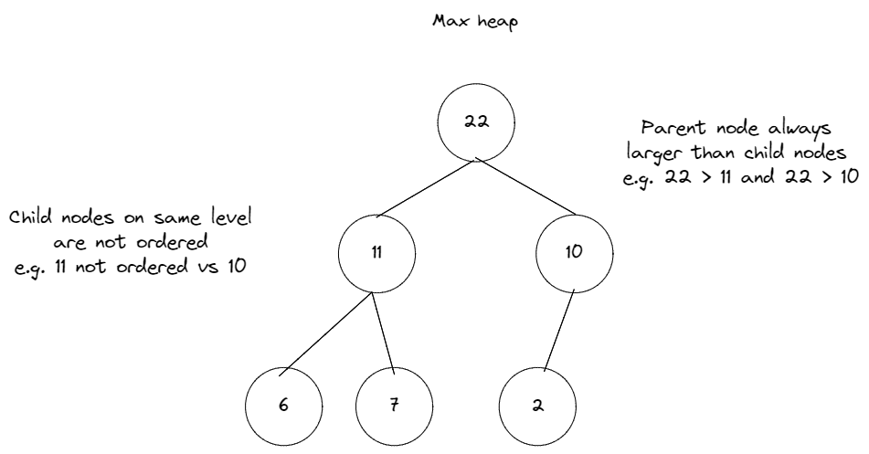
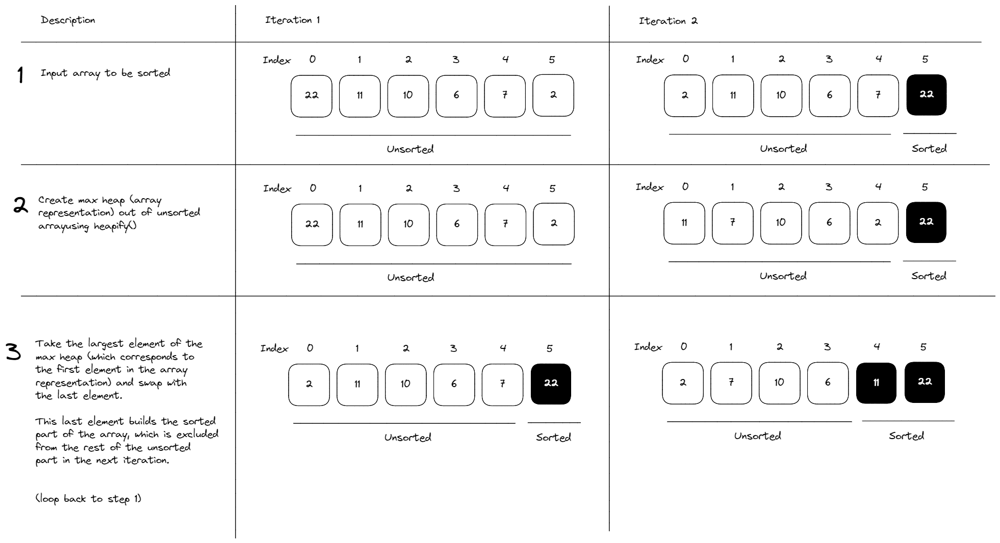

# Heap Sort

Implement a function that performs a heap sort. The function should take in an array of integers and return an array with the integers sorted in ascending order. The input array is modified in-place.

**Examples**

```javascript
heapSort([9, 3, 6, 2, 1, 11]); // [1, 2, 3, 6, 9, 11]
heapSort([12, 16, 14, 1, 2, 3]); // [1, 2, 3, 12, 14, 16]
```

**Recap**
Heap sort is a comparison-based sorting algorithm that iteratively builds the unsorted array into a max heap data structure to identify the max element, and progressively swaps it to the end of the unsorted array to build a sorted array.

**Max Heaps**
To understand heap sort, we need to first understand the heap data structure:

- A binary heap is a partially ordered, complete binary tree which satisfies a heap property, similar to binary search trees, but with different ordering.
- Heap property = Specific relationship between the parent and child nodes which specifies their order. One example is the max heap property, which specifies that all parent nodes have to >= than their child nodes. The order between child nodes on the same level does not matter. Hence, the largest nodes are always on the top, and the smallest nodes are at the bottom. Nodes on the same level are unordered:



- Complete binary tree = All levels of the tree are completely filled. If the last level is partially filled, it is filled first from left to right.
- Heaps are frequently implemented as arrays. We can use the following formula to compute the parent, left child and right child's indexes within the array representation of a heap:
  - Left child idx = 2 \_ parentIdx + 1
  - Right child idx = 2 \_ parentIdx + 2
  -
  - 
  -

### How Heap Sort Works

A heap sort essentially works by the following steps:



**Time Complexity:** Heap sort has a time complexity of O(n log n) in both average and worst-case scenarios, making it efficient for sorting large datasets.
In-place sorting: It sorts the data in-place, meaning it modifies the original list without requiring significant extra space.
Disadvantages of Heap Sort:

**Not Stable:** Heap sort is not a stable sorting algorithm. This means it might change the relative order of elements with equal values during the sorting process.
Overhead for Maintaining Heap: Building and maintaining the heap can introduce some overhead compared to simpler sorting algorithms for smaller datasets.

**When to Use Heap Sort:**
Heap sort is a good choice for sorting large datasets where efficiency is a priority and stability is not a concern.
It's often used in situations where additional operations like finding the maximum element are needed frequently, as the heap structure already provides efficient access to this information.
