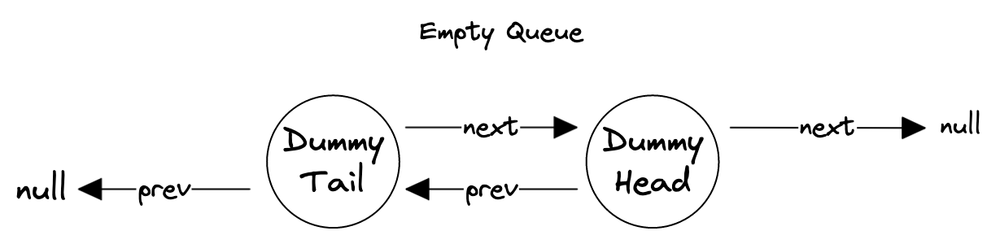
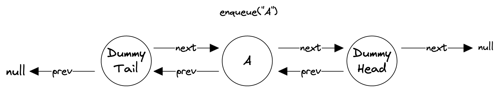
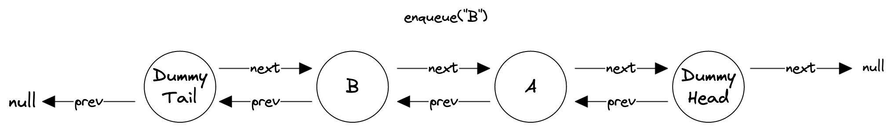
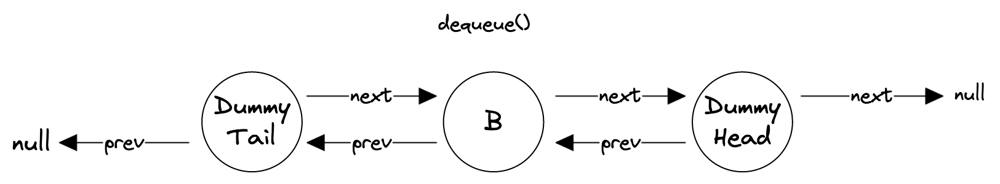

# Queue

Implement a queue data structure in JavaScript that contains the following operations:

new Queue(): Creates an instance of a Queue class that doesn't contain any items. The constructor does not accept any arguments.
enqueue(): Adds an item to the back of the queue. Required time complexity: O(1).
dequeue(): Removes an item from the front of the queue. Required time complexity: O(1).
isEmpty(): Determines if the queue is empty. Required time complexity: O(1).
front(): Returns the item at the front of the queue without removing it from the queue. Required time complexity: O(1).
back(): Returns the item at the back of the queue without removing it from the queue. Required time complexity: O(1).
length(): Returns the number of items in the queue. Required time complexity: O(1).

**Examples**

```javascript
const queue = new Queue();
queue.isEmpty(); // true
queue.enqueue(1);
queue.enqueue(2);
queue.length(); // 2
queue.enqueue(3);
queue.front(); // 1
queue.back(); // 3
queue.dequeue(); // 1
queue.isEmpty(); // false
```

## Solution

handling of linked list manipulation of empty queues, we make use of doubly-linked lists (nodes have both prev and next pointers) and dummy/sentinel head/tail nodes. With the usage of dummy nodes, the linked list will never be "empty" and we don't have to separately handle the case of enqueuing into empty queues and dequeuing a queue with only one item.



enqueue()-ing involves creating a new Node and adding it between the \_dummyTail node and \_dummyTail.next (which is \_dummyHead in the case of empty queues).





dequeue()-ing involves removing the node between the \_dummyHead node and \_dummyHead.prev. This should be a no-op if the queue is empty otherwise \_dummyTail will get dequeued.



Since the time complexity of length() has to be O(1) and counting the number of items in a linked list will take O(n), we need to separately track the number of items in the list with a \_length instance property and update it within the enqueue() and dequeue() methods.

Note that the autograder doesn't check if the time complexity of your enqueue() and dequeue() operations are O(1), but if you're only using a single JavaScript array to solve this question, then it's almost certainly not achieving O(1) time complexity for either of those operations.

```typescript
class Node<T> {
  value: T | undefined;
  next: Node<T> | null;
  prev: Node<T> | null;

  constructor(value?: T) {
    this.value = value;
    this.next = null;
    this.prev = null;
  }
}

export default class Queue<T> {
  _dummyHead: Node<T>;
  _dummyTail: Node<T>;
  _length: number;

  constructor() {
    this._dummyHead = new Node<T>();
    this._dummyTail = new Node<T>();
    this._dummyHead.prev = this._dummyTail;
    this._dummyTail.next = this._dummyHead;
    this._length = 0;
  }

  /**
   * Adds an item to the back of the queue.
   */
  enqueue(item: T) {
    const node = new Node(item);
    const prevLast = this._dummyTail.next;
    prevLast!.prev = node;

    node.next = prevLast;
    node.prev = this._dummyTail;
    this._dummyTail.next = node;
    this._length++;
    return this._length;
  }

  /**
   * Remove an item from the front of the queue.
   */
  dequeue(): T | undefined {
    if (this.isEmpty()) {
      return undefined;
    }

    const node = this._dummyHead.prev;
    const newFirst = node!.prev;
    this._dummyHead.prev = newFirst;
    newFirst!.next = this._dummyHead;
    // Unlink the node to be dequeued.
    node!.prev = null;
    node!.next = null;
    this._length--;
    return node!.value;
  }

  /**
   * Determines if the queue is empty.
   */
  isEmpty(): boolean {
    return this._length === 0;
  }

  /**
   * Returns the item at the front of the queue without removing it from the queue.
   */
  front(): T | undefined {
    if (this.isEmpty()) {
      return undefined;
    }

    return this._dummyHead.prev!.value;
  }

  /**
   * Returns the item at the back of the queue without removing it from the queue it.
   */
  back(): T | undefined {
    if (this.isEmpty()) {
      return undefined;
    }

    return this._dummyTail.next!.value;
  }

  /**
   * Returns the number of items in the queue.
   * @return {number} The number of items in the queue.
   */
  length(): number {
    return this._length;
  }
}
```

**Edge Cases**
Calling `dequeue()` on empty stacks.
Calling `front()` on empty stacks.
Calling `back()` on empty stacks.
